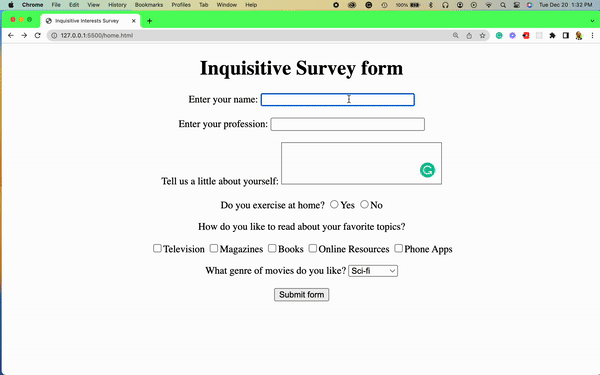

# Build an Inquisitive Survey form using HTML only

## Instructions:
### Objective: Build an app that is functionally similar to the demo GIF. 

### User Stories:

1. Add a `title element` within the head tag. 
2. Add a `form element` with the action attribute set to ` https://www.radicalx.co`.
3. Add a generic `div element` with  an `aligin="center"`attribute.
4. Add an `h1 element` with the heading of the form. 
5. Add an `input element` with the type of text, name, size, maxlength & value.
6. Add another `input element` with the type of text, name, size, maxlength & value.
7. Add a `textarea element` and specify the columns and rows, and name.
8. Add a `select element ` with type radio button, name, & value.
9. Add at least five `input elments` type checkbox, and name.
10. Add a `select element` with name attribute include five options.
11. Add a `input element` with the type submit and value attributes.